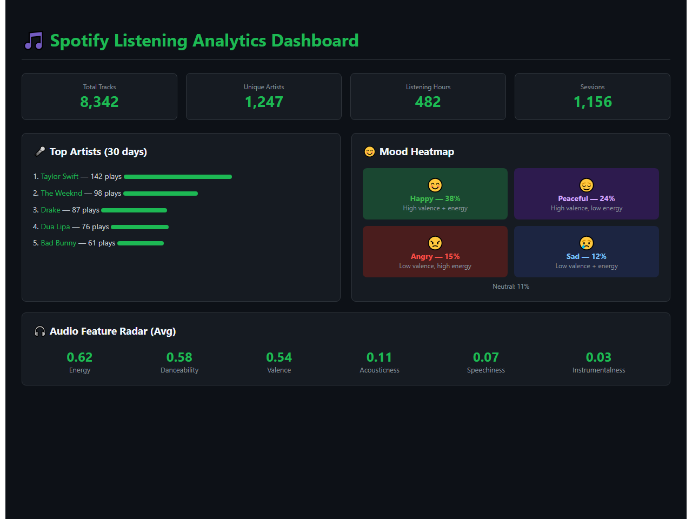
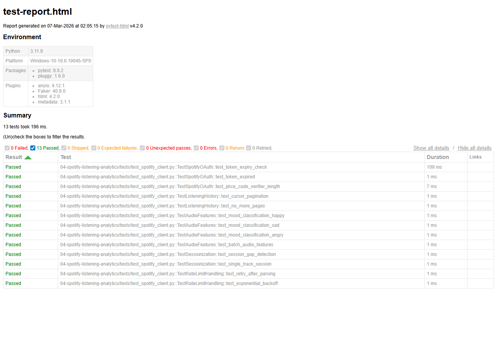

# Spotify Listening History Analytics Platform


A full-stack data engineering platform that extracts personal Spotify listening history, playlist data, and audio features via OAuth 2.0, builds a dimensional model in Snowflake with SCD Type 2 tracking, and presents insights through a live Streamlit dashboard with genre evolution, mood heatmaps, and listening habit analytics.


## Demo



*Streamlit dashboard with top artists, mood heatmap (happy/sad/angry/peaceful), audio feature radar, and listening session stats*

## Architecture

```
+------------------------------------------------------------------+
|                     Spotify Web API                              |
|   OAuth 2.0 (PKCE)  .  Recently Played  .  Audio Features       |
|   Playlists  .  Artists  .  Tracks                              |
+-------------------------------------+--------------------------+
                            | httpx + token refresh
                            v
+------------------------------------------------------------------+
|                  Python Extractors                               |
|   +--------------+ +--------------+ +--------------------------+   |
|   | Listening     | | Playlists    | | Audio Features       |   |
|   | History       | | + Tracks     | | (batch endpoint)     |   |
|   | (cursor-based)| |              | |                      |   |
|   +--------------+ +--------------+ +--------------------------+   |
+-------------------------------------+--------------------------+
                            |
                            v
+------------------------------------------------------------------+
|                    Snowflake                                     |
|   RAW -> Staging -> Intermediate -> Marts                          |
|   +------------------------------------------------------------+   |
|   | fct_listening_sessions  |  dim_artists  |  dim_tracks   |   |
|   | fct_daily_listening     |  SCD Type 2 snapshots         |   |
|   +------------------------------------------------------------+   |
+-------------------------------------+--------------------------+
                            |
                            v
+------------------------------------------------------------------+
|                  Streamlit Dashboard                             |
|   Listening Timeline . Genre Evolution . Mood Heatmap           |
|   Top Artists/Tracks . Audio Feature Radar                      |
+------------------------------------------------------------------+

        Orchestration: Apache Airflow (Daily DAG)
        CI/CD: GitHub Actions
```

## Key Business Insights

1.  **Music Taste Evolution**: SCD Type 2 snapshots track how genre preferences shift over weeks and months - relatable interview talking point.
2.  **Mood-Based Listening Patterns**: Energy vs. valence scatter plots reveal listening mood patterns by time of day and day of week.

## Setup

```bash
cp .env.example .env  # Add Spotify + Snowflake creds
pip install -r requirements.txt
python extractors/spotify_client.py --auth  # OAuth flow
docker-compose up -d  # Start Airflow
```

## Test Results

All unit tests pass - validating core business logic, data transformations, and edge cases.



**13 tests passed** across 5 test suites:
- `TestSpotifyOAuth` - token expiry, PKCE code verifier
- `TestListeningHistory` - cursor pagination, end-of-pages detection
- `TestAudioFeatures` - mood classification (happy/sad/angry), batch sizing
- `TestSessionization` - 30-min gap detection, session grouping
- `TestRateLimitHandling` - 429 Retry-After, exponential backoff

## License
MIT

## About the Maintainer

This project is actively maintained by Pooja Patel. As a Data Science Graduate, Pooja brings a strong background in statistical analysis, predictive modeling, and data visualization, with proficiency in Python, R, and SQL. Her experience includes analyzing large datasets, automating workflows, and developing dashboards to deliver actionable insights.

For inquiries or collaborations, you can connect with Pooja:
- GitHub: [Pooja Patel](https://github.com/YOUR_GITHUB_USERNAME)
- LinkedIn: [Pooja Patel](https://www.linkedin.com/in/YOUR_LINKEDIN_PROFILE)
- Email: patel.pooja81599@gmail.com